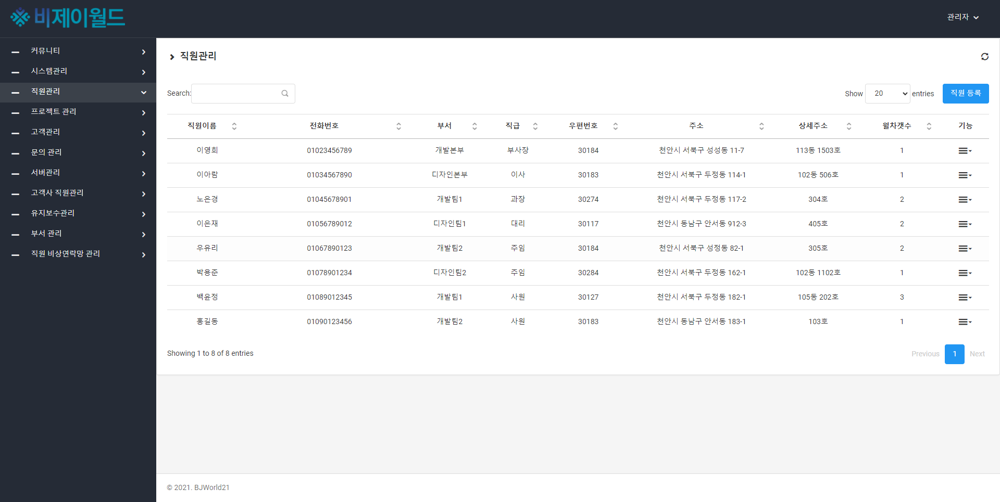
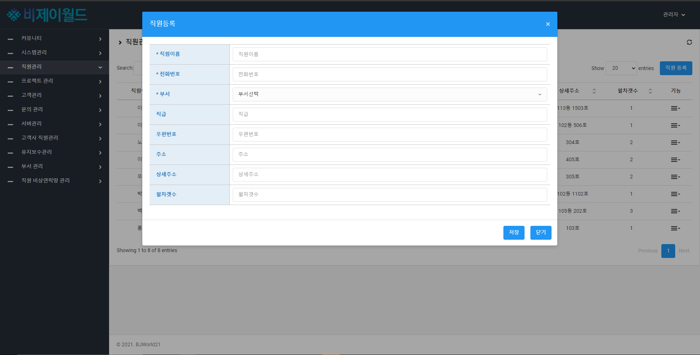
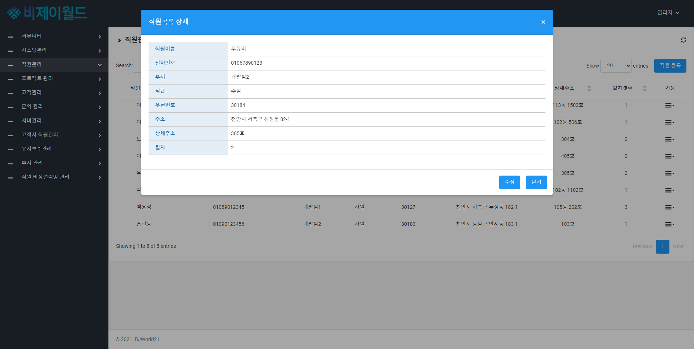
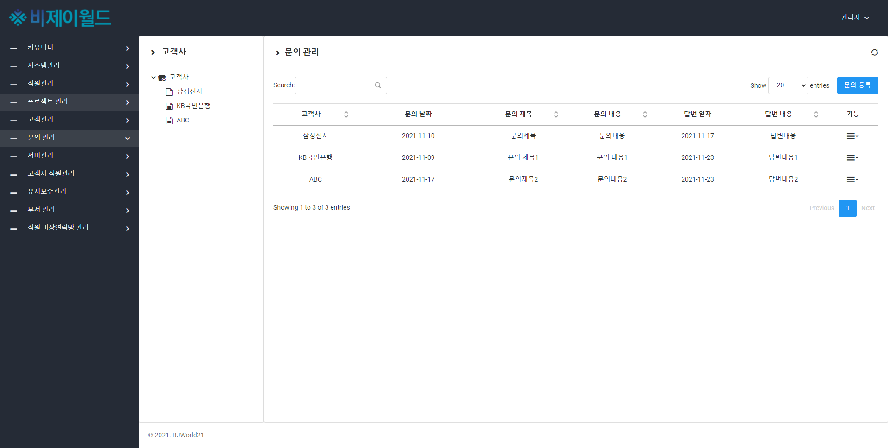
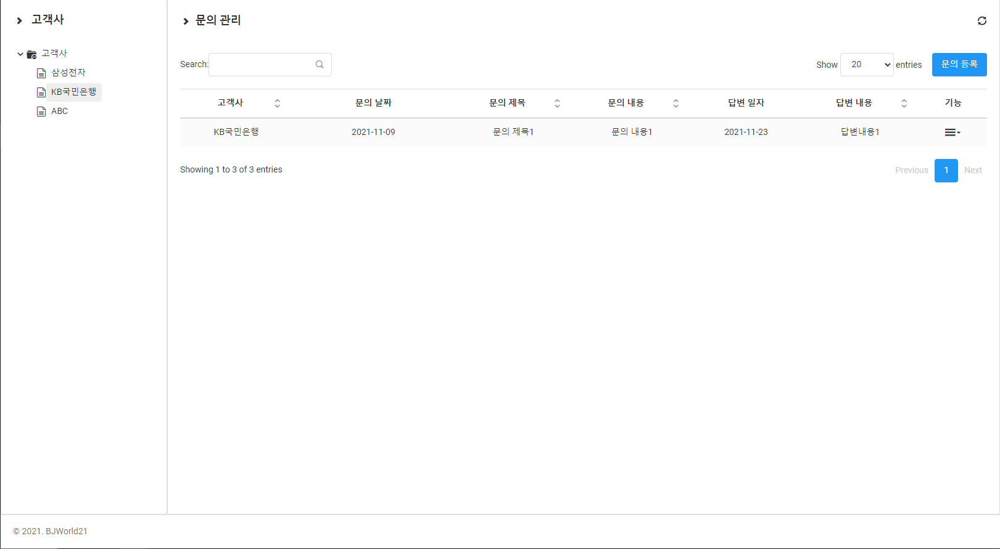
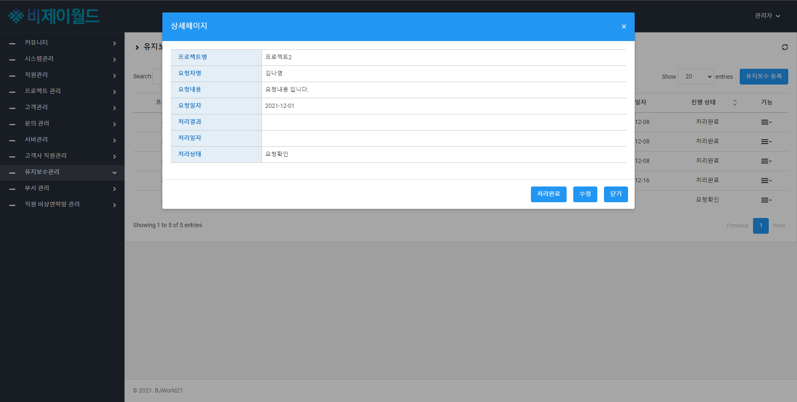
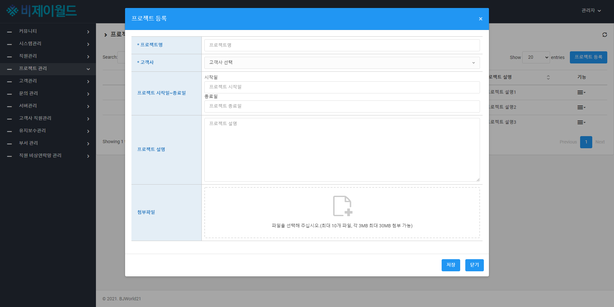
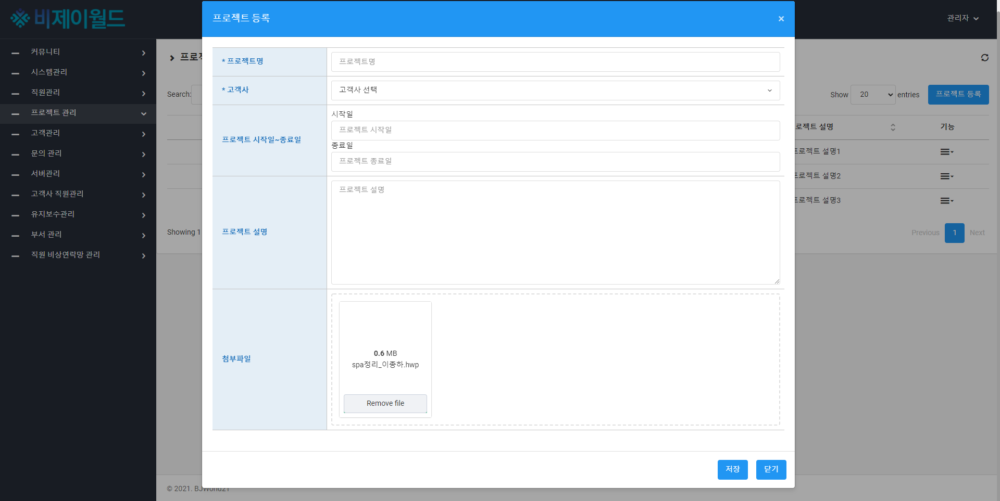
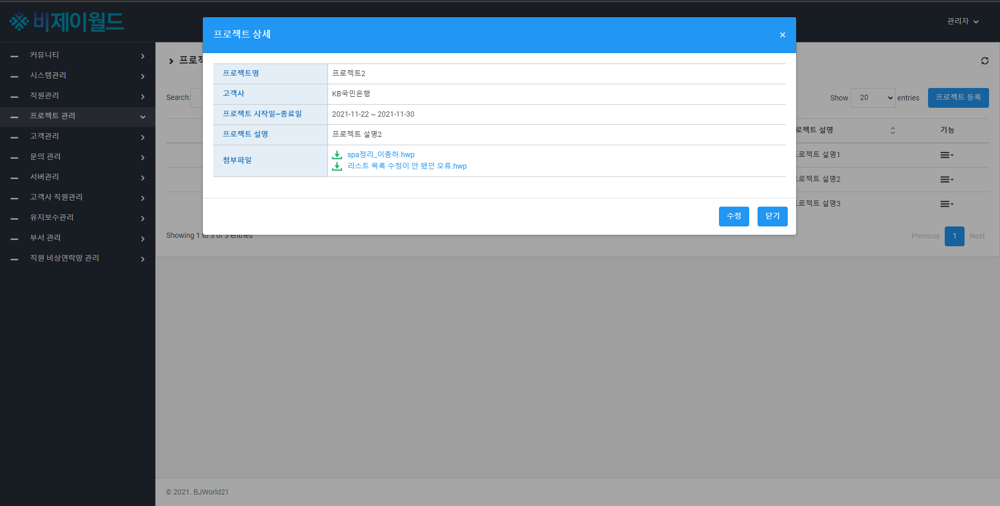

# 그룹웨어프로젝트
비제이월드에서 인턴으로 근무 하면서 관리자 페이지 작업을 하였습니다.

데이터베이스는 MariaDB, 서버는 Tomcat을 사용하였고, 언어는 HTML, JAVA, Jquery, JavaScript를 사용하였습니다.

그룹웨어프로젝트에서 직원관리, 문의관리, 유지보수관리, 프로젝트관리, 고객사 직원관리 페이지 작업을 맡았습니다.

<b>1. 직원관리<b>
- 직원관리 화면
</img>
직원관리 화면에서 직원을 등록할 수 있는 기능을 구현하였습니다. 부서는 부서테이블에서 데이터를 불러와 select로 구현.
- 직원관리 form화면
</img>

- 직원관리 상세화면
</img>

2.문의관리
- 문의관리 화면
</img>
문의관리에서 문의를 작성할 수 있게 구현하였습니다. 여기서는 고객사테이블의 데이터를 불러와 select로 구현. 
또한 서브메뉴로 회사별로 문의를 관리할 수 있게 구현하였습니다.
</img>

3. 유지보수관리
- 유지보수관리화면에서는 프로젝트의 유지보수를 관리 할 수 있습니다.

요청자가 요청내용을 적으면 진행상태에 요청확인이 뜨고 처리일자와 처리결과를 입력하면 진행상태에 처리완료 출력.

-유지보수관리 상세화면
</img>
상세화면에서 처리완료버튼을 구현하여 상세화면에서도 진행상태 변경가능

4. 프로젝트 관리
- 프로젝트관리
프로젝트를 관리할 수 있는 페이지 입니다.

-프로젝트관리 첨부파일 기능
파일을 첨부할 수 있는 기능을 구현하였습니다.
</img>
</img>
</img>

5. 필수 입력값

</img>
모든 페이지 수정화면에서 필수입력값 처리를 하였습니다.

 
